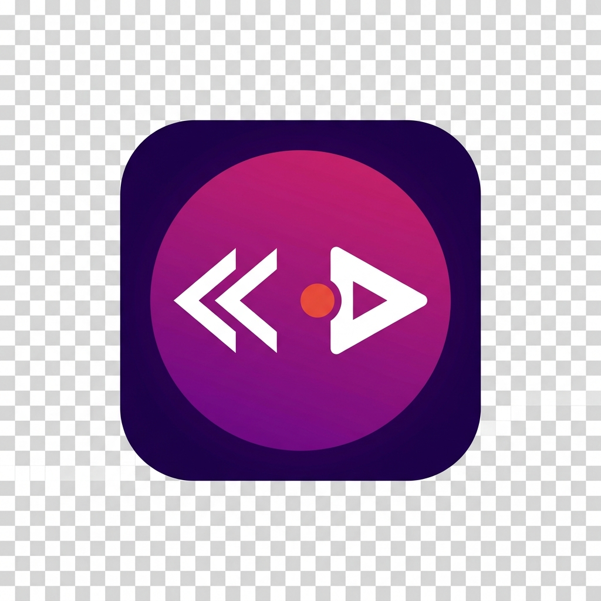
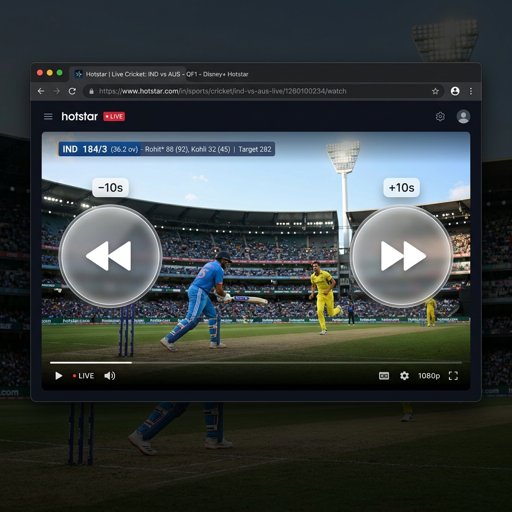

<div align="center">
  
  <h1>Bring Back Live Seek</h1>
  <p><strong>Restores rewind &amp; fast-forward controls on Hotstar live streams.</strong></p>

  <!-- Primary install badges -->
  <a href="https://github.com/ramvignesh-b/bbls/releases/latest">
    
  </a>
  <a href="https://github.com/ramvignesh-b/bbls/releases/latest">
    
  </a>
  <a href="https://raw.githubusercontent.com/ramvignesh-b/bbls/dist/bbls.user.js">
    
  </a>

  <br /><br />

  <!-- Meta badges -->
  
  
  
  

  <br /><br />

  
</div>

---

## ✨ Features

| | |
|---|---|
| ⏪ **Live Seek** | Rewind or fast-forward **±10 seconds** on live streams — the control Hotstar removed. |
| 💎 **Glassmorphism UI** | Frosted-glass buttons with subtle backdrop blur blend seamlessly into the player. |
| 🌊 **Rich Animations** | Ripple, icon-nudge, and floating feedback labels on every seek. |
| ⌨️ **Keyboard Shortcuts** | `←` / `→` arrow keys work too — no mouse needed. |
| 📱 **Responsive** | Buttons auto-resize on smaller viewports (≤ 600 px). |
| 🔌 **Zero Permissions** | No host permissions, no network requests, no data collected. |
| ♿ **Accessible** | Proper `aria-label` attributes and keyboard-navigable buttons. |
| 🔄 **SPA-Aware** | A `MutationObserver` watches Hotstar's React state — the overlay appears and cleans up as you navigate. |

---

## 🚀 Install

### Option 1 — Chrome (manual install from GitHub Releases)

> [!NOTE]
> The extension is not on the Chrome Web Store. Install it in two minutes via Developer mode — no account needed.

1. Go to the **[Releases page](https://github.com/ramvignesh-b/bbls/releases/latest)** and download **`chrome.zip`**.
2. Unzip the file anywhere (e.g. `~/Downloads/bbls-chrome/`).
3. Open **`chrome://extensions`** in your browser.
4. Toggle on **Developer mode** (top-right corner).
5. Click **Load unpacked** → select the unzipped folder.
6. Done — navigate to any Hotstar live stream to see the buttons.

> [!TIP]
> To update: download the new `chrome.zip` from the latest release, replace the folder contents, and click the **↻ refresh** icon on the extension card.

### Option 2 — Firefox Add-on

The Firefox AMO listing is pending review. In the meantime, download `firefox.zip`
from the **[latest release](https://github.com/ramvignesh-b/bbls/releases/latest)**
and load it via `about:debugging` — see [Development → Firefox](#load-as-a-temporary-add-on-firefox) below.

### Option 3 — Tampermonkey / Violentmonkey (all browsers)

1. Install [Tampermonkey](https://www.tampermonkey.net/) or [Violentmonkey](https://violentmonkey.github.io/).
2. Open the direct install link:

   **[Install userscript](https://raw.githubusercontent.com/ramvignesh-b/bbls/dist/bbls.user.js)**

   Your script manager will prompt you to confirm the install.

---

## ⌨️ Keyboard Shortcuts

| Key | Action |
|-----|--------|
| `←` Arrow Left | Rewind 10 seconds |
| `→` Arrow Right | Fast-forward 10 seconds |

> [!NOTE]
> Shortcuts are suppressed when focus is inside a text field so they don't interfere with Hotstar's own inputs (e.g. search).

---

## 🛠 Development

### Prerequisites

- Node.js ≥ 18
- `zip` CLI (pre-installed on macOS and Linux; on Windows use WSL or Git Bash)

### Local Build

```bash
git clone https://github.com/ramvignesh-b/bbls.git
cd bbls
npm run build
```

After a successful build, `dist/` will contain:

```
dist/
├── bbls.user.js   # Tampermonkey / GreasyFork userscript
├── chrome.zip     # Chrome extension (load unpacked via chrome://extensions)
└── firefox.zip    # Firefox add-on (AMO / load temporary add-on)
```

### Load as an Unpacked Extension (Chrome)

1. Run `npm run build`.
2. Open `chrome://extensions` → enable **Developer mode**.
3. Click **Load unpacked** → select `dist/chrome/`.
4. Navigate to `https://www.hotstar.com/in/video/live/watch/anything`.

### Load as a Temporary Add-on (Firefox)

1. Run `npm run build`.
2. Open `about:debugging#/runtime/this-firefox`.
3. Click **Load Temporary Add-on** → select `dist/firefox/manifest.json`.

---

## 🚢 Publishing

All pipelines are triggered by pushing a semver tag:

```bash
# Bump version in package.json and both manifests, then:
git tag v1.2.3
git push origin v1.2.3
```

The `release.yml` workflow will:

1. Build all artifacts.
2. Create a **GitHub Release** with `bbls.user.js`, `chrome.zip`, and `firefox.zip` attached.
3. Sign and submit `firefox.zip` to **Firefox AMO** (requires `AMO_JWT_ISSUER` + `AMO_JWT_SECRET` secrets).
4. Push `bbls.user.js` to the `dist` branch so Tampermonkey users get automatic updates.

> [!NOTE]
> `chrome.zip` is bundled in every release for users to install manually — see [Option 1](#option-1--chrome-manual-install-from-github-releases).

---

## 📁 Project Structure

```
bbls/
├── .github/workflows/
│   ├── ci.yml            # Build check on every push/PR
│   ├── release.yml       # Orchestrate full release on v* tags
│   ├── firefox.yml       # Firefox AMO (manual dispatch)
│   └── greasyfork.yml    # GreasyFork dist-branch sync (manual dispatch)
├── src/
│   ├── core.js               # Content script — the extension behaviour
│   ├── manifest.chrome.json  # Manifest V3 for Chrome
│   └── manifest.firefox.json # Manifest V3 for Firefox (+ gecko settings)
├── icons/                # Icon set (16, 32, 48, 128 px)
├── screenshots/          # Store listing assets
├── scripts/
│   └── build.mjs         # Zero-dependency Node build script
├── CHANGELOG.md
├── LICENSE
└── README.md
```

---

## 🤝 Contributing

Bug reports and feature requests are welcome — please open an [issue](https://github.com/ramvignesh-b/bbls/issues).

For code changes:

1. Fork the repo and create a branch: `git checkout -b fix/my-fix`
2. Make your changes in `src/core.js`.
3. Run `npm run build` and verify the build succeeds.
4. Open a pull request — CI will validate the build automatically.

---

## 📄 License

MIT © [RamVignesh B](https://hi.ramvignesh.dev)
